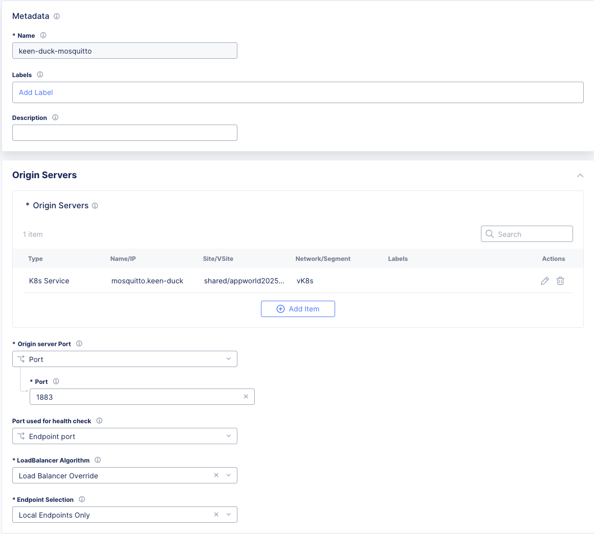

1. Complete standard lab up until the point you have a vk8s cluster and download your kubeconfig file.
3. Launch web shell for Jumpbox and Grafana machine
4. Clone caaslab github repo
```bash
cd ~
git clone https://github.com/GlenWillms/caaslab.git
```
3. Set NAMESPACE environment variable
```bash

### Enter your own namespace value
export NAMESPACE=keen-duck

```

***>>>Exception***
During testing we don't have wildcard DNS resolution to our CEs, as a result we'll need to add entries to the host file for the lab to be successful.

```bash
cat >> /etc/hosts<< EOF
34.48.159.144 $NAMESPACE.useast.lab-app.f5demos.com
35.236.21.11  $NAMESPACE.uswest.lab-app.f5demos.com
34.89.198.113 $NAMESPACE.europe.lab-app.f5demos.com
EOF
```
***>>>End Exception***

4. Upload kubeconfig file to jumpbox using fileserver and set KUBECONFIG environment variable to point to kubeconfig file.
```bash
export KUBECONFIG=/srv/filebrowser/ves_$NAMESPACE\_$NAMESPACE-vk8s.yaml
```

5. Deploy manifests
```bash
cd ~/caaslab
kubectl apply -f vk8s/
```
6. Deploy origin pool as follows

Reference the k8s service mosquitto for your namespace as: mosquitto.namespace
Set the origin server selection to be **local endpoints only**.

8. Deploy the load balancer
![[Pasted image 20241227111739.png]]

![[Pasted image 20241227111758.png]]
![[Pasted image 20241227111820.png]].
9. Deploy grafana instance
```bash
cd ~/caaslab/docker-grafana
docker compose up -d
```
10. Run the stats generation from your web shell
```bash
~/caaslab/systemstats2mqtt.sh
```

11. View your live data from Grafana
 ![[Pasted image 20241227112210.png]]
Click through to view your dashboard:
![[Pasted image 20241227112326.png]]
