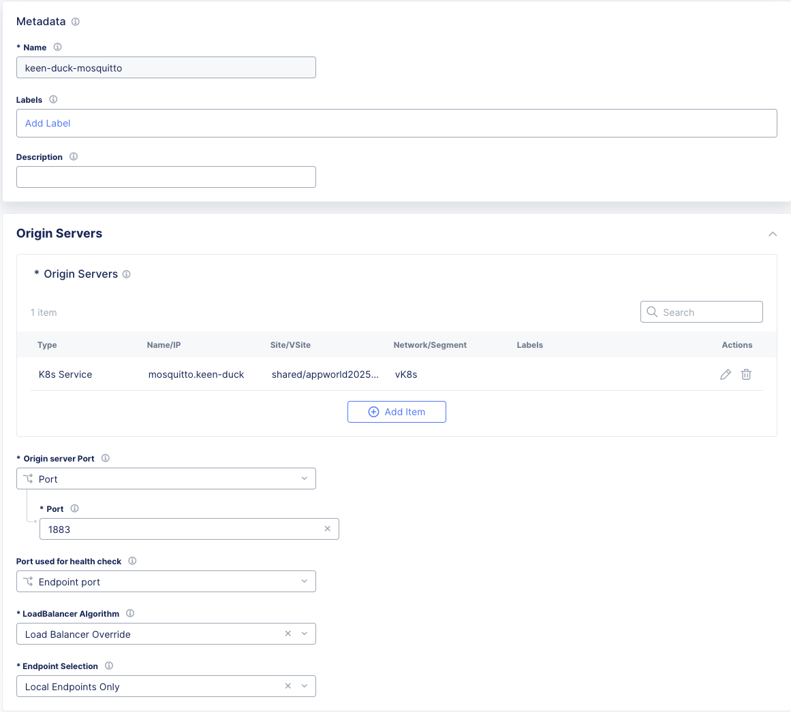
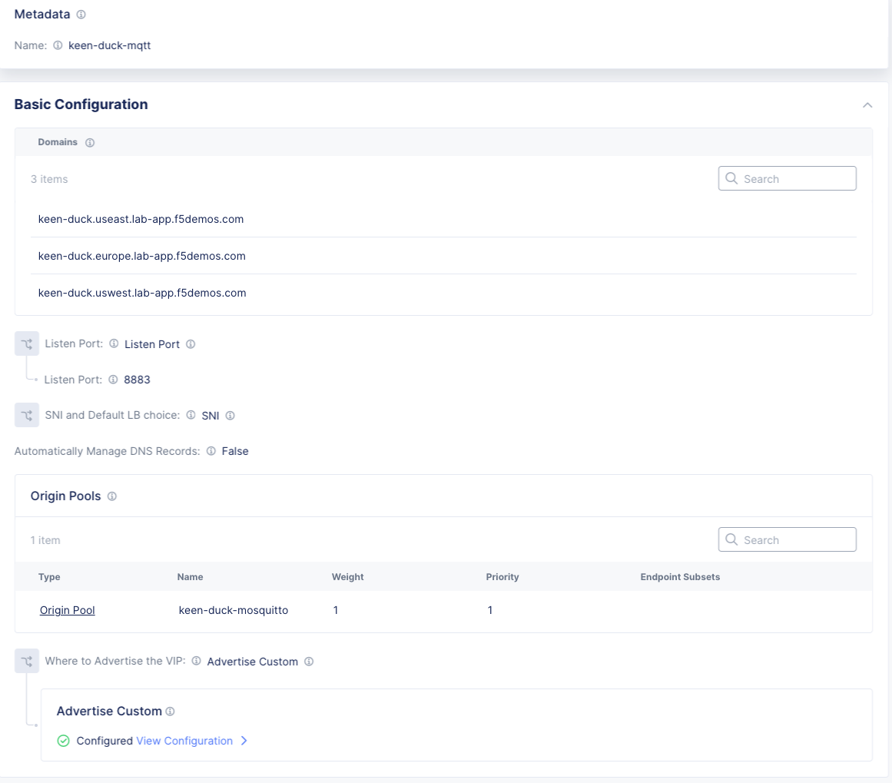
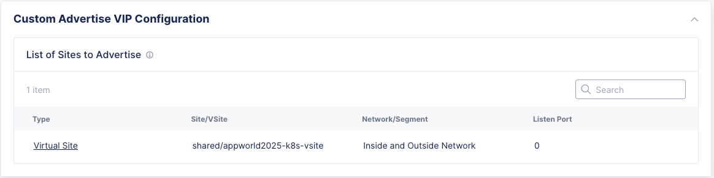
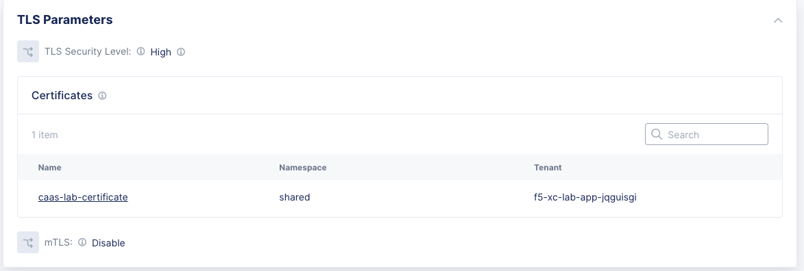
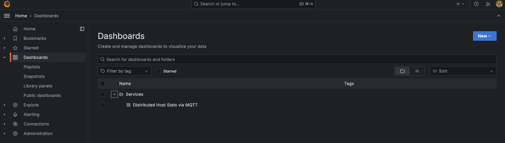
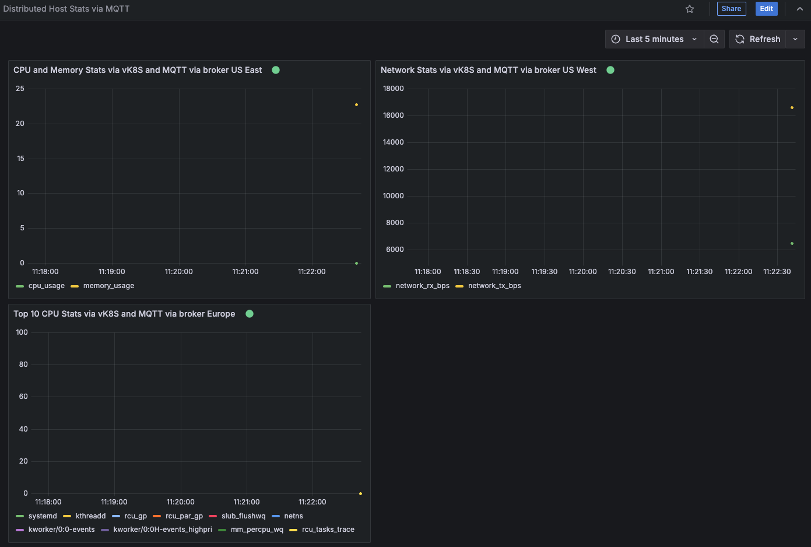

1. Complete standard lab up until the point you have a vk8s cluster and download your kubeconfig file. 
3. Launch web shell for Jumpbox and Grafana machine
4. Clone caaslab github repo
```bash
cd ~
git clone https://github.com/GlenWillms/caaslab.git
```
3. Set NAMESPACE environment variable
```bash

### Enter your own namespace value
export NAMESPACE=keen-duck 
```

***>>>Exception***
During testing we don't have wildcard DNS resolution to our CEs, as a result we'll need to add entries to the host file for the lab to be successful. 

```bash
cat >> /etc/hosts<< EOF
34.48.159.144 $NAMESPACE.useast.lab-app.f5demos.com
35.236.21.11  $NAMESPACE.uswest.lab-app.f5demos.com
34.89.198.113 $NAMESPACE.europe.lab-app.f5demos.com
EOF

#Let's review - just to make sure it looks right:
cat /etc/hosts
```
***>>>End Exception***

4. Upload kubeconfig file to jumpbox using fileserver and set KUBECONFIG environment variable to point to kubeconfig file. 
```bash 
export KUBECONFIG=/srv/filebrowser/ves_$NAMESPACE\_$NAMESPACE-vk8s.

#Let's review again to confirm that we can reach the cluster:
kubectl config view
```

5. Deploy manifests
```bash
cd ~/caaslab
kubectl apply -f vk8s/
```
6. Deploy origin pool as follows

Reference the k8s service mosquitto for your namespace as: mosquitto.namespace
Set the origin server selection to be **local endpoints only**.  *Json Template Below*


```json
{
  "metadata": {
    "name": "adjective-animal-mosquitto",
    "labels": {},
    "annotations": {},
    "disable": false
  },
  "spec": {
    "origin_servers": [
      {
        "k8s_service": {
          "service_name": "mosquitto.adjective-animal",
          "site_locator": {
            "virtual_site": {
              "tenant": "f5-xc-lab-app-jqguisgi",
              "namespace": "shared",
              "name": "appworld2025-k8s-vsite",
              "kind": "virtual_site"
            }
          },
          "vk8s_networks": {}
        },
        "labels": {}
      }
    ],
    "no_tls": {},
    "port": 1883,
    "same_as_endpoint_port": {},
    "healthcheck": [],
    "loadbalancer_algorithm": "LB_OVERRIDE",
    "endpoint_selection": "LOCAL_ONLY"
  }
}
```

8. Deploy the ***TCP*** load balancer (multi-app connect)



. 

```json
{
  "metadata": {
    "name": "adjective-animal-mqtt",
    "labels": {},
    "annotations": {},
    "disable": false
  },
  "spec": {
    "domains": [
      "adjective-animal.useast.lab-app.f5demos.com",
      "adjective-animal.europe.lab-app.f5demos.com",
      "adjective-animal.uswest.lab-app.f5demos.com"
    ],
    "listen_port": 8883,
    "sni": {},
    "dns_volterra_managed": false,
    "origin_pools": [],
    "origin_pools_weights": [
      {
        "pool": {
          "tenant": "f5-xc-lab-app-jqguisgi",
          "namespace": "adjective-animal",
          "name": "adjective-animal-mosquitto",
          "kind": "origin_pool"
        },
        "weight": 1,
        "priority": 1,
        "endpoint_subsets": {}
      }
    ],
    "advertise_custom": {
      "advertise_where": [
        {
          "virtual_site": {
            "network": "SITE_NETWORK_INSIDE_AND_OUTSIDE",
            "virtual_site": {
              "tenant": "f5-xc-lab-app-jqguisgi",
              "namespace": "shared",
              "name": "appworld2025-k8s-vsite",
              "kind": "virtual_site"
            }
          },
          "use_default_port": {}
        }
      ]
    },
    "tls_tcp": {
      "tls_cert_params": {
        "tls_config": {
          "default_security": {}
        },
        "certificates": [
          {
            "tenant": "f5-xc-lab-app-jqguisgi",
            "namespace": "shared",
            "name": "caas-lab-certificate",
            "kind": "certificate"
          }
        ],
        "no_mtls": {}
      }
    },
    "service_policies_from_namespace": {}
  }
}
```

9. Deploy grafana instance
```bash
cd ~/caaslab/docker-grafana
docker compose up -d
```
10. Run the stats generation from your web shell
```bash
~/caaslab/systemstats2mqtt.sh
```

11. View your live data from Grafana
 
Click through to view your dashboard:
